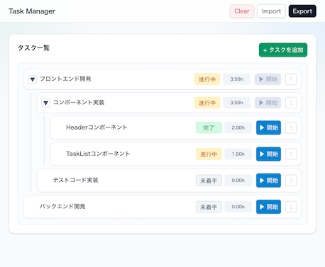

# タスク管理アプリ

タスクの詳細と実績時間を管理する React 学習用アプリケーションです。  
実装は AI のサポートを受けながら進めています。



## 機能

- タスクのCRUD（作成・読み取り・更新・削除）
- タスクの階層構造（深さ最大5階層・子タスク最大20件）
- タスクツリーの折りたたみ表示
- ステータス管理（未着手・進行中・完了）
- 開始/終了タイマーによる実績時間の自動算出
- 実績時間の自動集計
- データインポート / エクスポート（JSON）
- 保存済みデータの全削除（Clear）
- localStorage 永続化の ON/OFF 切り替え

## 技術スタック

| 項目 | 内容 |
|------|------|
| フレームワーク | React + Vite |
| 言語 | TypeScript |
| スタイリング | Tailwind CSS |
| テスト | Vitest + React Testing Library |
| データ保存 | localStorage |
| デプロイ | GitHub Pages |

## 開発環境のセットアップ

```bash
npm install
npm run dev
```

## 環境変数

デフォルトでは localStorage 永続化は無効です。  
有効にする場合はプロジェクトルートに `.env.local` を作成して以下を設定します。

```env
VITE_ENABLE_LOCAL_STORAGE_PERSIST=true
```

## テスト

```bash
# テスト実行（ウォッチモード）
npm test

# カバレッジ計測
npm run test:coverage
```

## 品質チェック

```bash
npm run lint
npm run build
```

## ドキュメント

- [要件定義](docs/requirements.md)
- [データモデル](docs/data-model.md)
- [画面設計・コンポーネント構成](docs/screen-design.md)
- [開発中のメモ](docs/development-memo.md)
